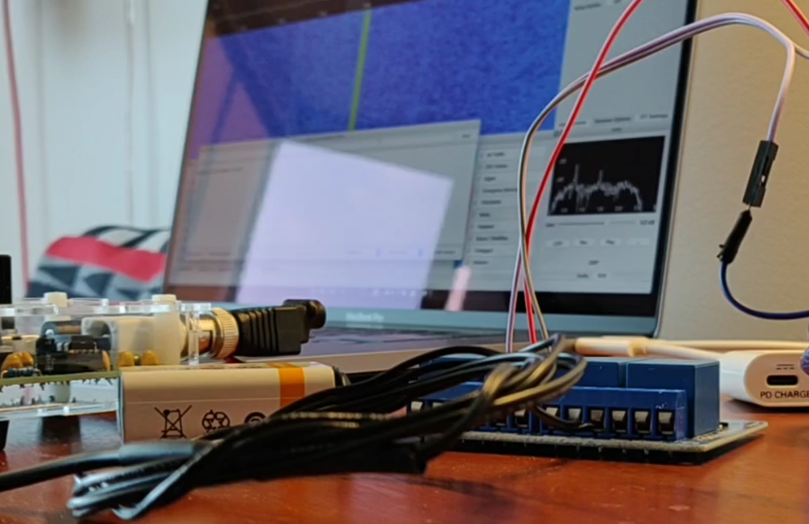

# arduino-cw-key

## Description

Automatic CW keying via an Arduino-compatible device attached to a relay (attached to a transceiver).

## Current status

- 10/1/2020 – Code written to completion and ready for distance testing.  First transmission (pictured above) was done using a dummy load on the S-Pixie QRP transceiver.  (Was picked up within a couple of feet using a USB RTL-SDR dongle.)

## License

[GPT-3](LICENSE.md)